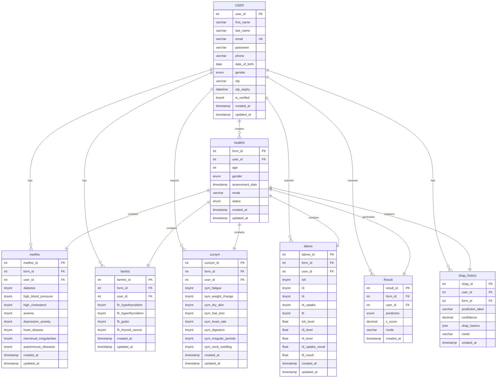

# ThyroSight Database ERD

## Entity Relationship Diagram

## Table Descriptions

### USER
Central table storing user account information, authentication details, and profile data.

### healthA (Health Assessment)
Main assessment record that links all other assessment-related tables. Each form submission creates one record here.

### medhis (Medical History)
Stores user's medical conditions (8 fields): diabetes, blood pressure, cholesterol, anemia, depression/anxiety, heart disease, menstrual issues, autoimmune diseases.

### famhis (Family History)
Stores family history of thyroid conditions (4 fields): hypothyroidism, hyperthyroidism, goiter, thyroid cancer.

### cursym (Current Symptoms)
Stores current symptoms reported by user (8 fields): fatigue, weight change, dry skin, hair loss, heart rate changes, digestion issues, irregular periods, neck swelling.

### labres (Lab Results)
Stores laboratory test results with both flags (yes/no) and actual numeric values for TSH, T3, T4, T4 Uptake, and FTI tests.

### Result
Stores the prediction outcome (normal/hypo/hyper) with confidence score for each assessment.

### shap_history
Stores SHAP (SHapley Additive exPlanations) factors as JSON for explainable AI predictions.

## Relationships

- **One USER** can have **many assessments** (healthA)
- **One healthA** record has **one** of each: medhis, famhis, cursym, labres, Result, shap_history
- All child tables reference both `user_id` and `form_id` for data integrity
- CASCADE DELETE ensures when a user or assessment is deleted, all related data is removed

## Key Features

1. **Normalized Design**: Separate tables for different data categories
2. **Foreign Key Constraints**: Maintain referential integrity
3. **Cascade Operations**: Automatic cleanup of related records
4. **Timestamps**: Track creation and updates
5. **Flexible Lab Results**: Store both test availability flags and actual values
6. **JSON Storage**: SHAP factors stored as JSON for flexibility
